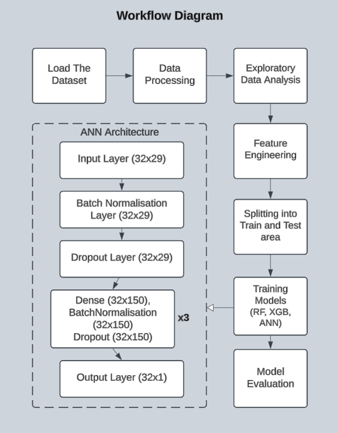

# Predictive Analytics for Loan Defaults using Deep Learning

Loan defaults pose a major risk in the financial sector, often leading to significant credit losses and operational disruptions. This project presents a deep learning–centric approach to default prediction by leveraging an Artificial Neural Network (ANN) capable of modeling complex, non-linear relationships in borrower and loan data. While traditional models like Random Forest and XGBoost are used as benchmarks, the core strength lies in the ANN architecture, which incorporates multiple dense layers, batch normalization, and dropout to ensure robust generalization and high predictive accuracy.

## 📌 Project Objectives

- **Build a Predictive Model**: Develop a robust deep learning model (ANN) and compare it with traditional models (Random Forest and XGBoost) to predict loan default probabilities.
- **Identify Key Drivers**: Use exploratory data analysis (EDA) to extract patterns from borrower profiles, loan features, and repayment histories.
- **Reduce Credit Losses**: Proactively identify high-risk borrowers to minimize financial loss.
- **Enhance Decision-Making**: Provide actionable insights for loan approval and portfolio management.
- **Improve Operational Efficiency**: Automate risk assessments and streamline decision-making processes.

## 🗂️ Dataset

- **Source**: LendingClub and other public financial datasets.
- **Features**: Includes borrower demographics, loan amount, interest rate, repayment history, credit history, and more.

## 🧠 Model Architecture

This project utilizes both traditional machine learning models (Random Forest and XGBoost) and a deep learning-based Artificial Neural Network (ANN). While RF and XGB offer solid performance on structured data, the ANN—featuring multiple dense layers with batch normalization and dropout—significantly outperformed them.

  

The ANN architecture begins with an input layer of shape (32×29), followed by batch normalization and dropout layers. It then passes through three hidden blocks, each containing a dense layer (32×150), batch normalization, and dropout. Finally, the output layer predicts the probability of default. The ANN achieved a ROC-AUC score of 0.905, outperforming Random Forest (0.725) and XGBoost (0.734), highlighting its superior ability to capture complex, non-linear patterns in financial data.

## 📊 Model Evaluation

<table>
  <tr>
    <th>Model</th>
    <th>Description</th>
    <th>ROC-AUC Score</th>
  </tr>
  <tr>
    <td><strong>Random Forest</strong></td>
    <td>Traditional ensemble learning method effective for structured tabular data.</td>
    <td>0.725</td>
  </tr>
  <tr>
    <td><strong>XGBoost</strong></td>
    <td>Gradient-boosted trees model with high efficiency and accuracy.</td>
    <td>0.734</td>
  </tr>
  <tr>
    <td><strong>ANN (Deep Learning)</strong></td>
    <td>Multi-layer neural network with batch normalization and dropout for generalization.</td>
    <td><strong>0.905</strong></td>
  </tr>
</table>

> The Artificial Neural Network significantly outperformed the other models, demonstrating superior capability in modeling complex, non-linear relationships.
